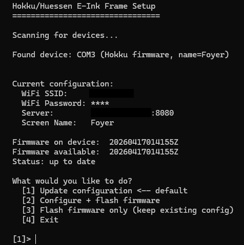

# Hokku/Huessen 13.3" E-Ink Frame open source firmware and image server

Open source firmware and image server for the Hokku / Huessen 13.3" six-color e-ink photo frame.

## Features

### Image management (web GUI at `http://server:port/`)

- **Drag-and-drop upload** anywhere on the page, or click the upload zone to browse. Multiple files at a time with a per-file progress list; filename collisions auto-suffixed (`_1`, `_2`, …).
- **Per-image trash button** with a styled confirmation dialog (Esc cancels, Enter confirms, click backdrop dismisses). Removes the original *and* its cached dithered binary, preview PNG, and thumbnail.
- **Image grid shows every uploaded file immediately**, including those still being converted. Pending entries get a yellow *Dithering…* badge and a faded thumbnail. Status bar reads `N / M ready` during batch conversions.
- **Per-image stats**: shown count, total display time (`2h 14m`, `3d 5h`), last-displayed timestamp.
- **"Show Next" button** on each image to force it to be served on the next refresh.
- **Originals stay accessible**: each card links to the original (auto-converted to JPEG for HEIC/TIFF/etc. so any browser can preview) and the dithered preview as the screen will render it.
- **Connected screens table**: name, IP, battery percentage (red below 20%), request count, last-seen timestamp, next-scheduled update, and a *Details* button opening a per-screen state modal.
- **Per-screen Details modal** showing every field the frame self-reports (firmware version, boot count, wake cause, regime, WiFi RSSI, free heap, clock drift, scheduled next refresh, sleep error, USB state, WiFi cache hit).
- **Overdue-screen warning banner** when any frame is more than an hour past its scheduled next refresh.
- **Configuration panel**: timezone (with live server time), refresh schedule (multiple HHMM entries), orientation (landscape / portrait), poll interval, dither algorithm, Debug Fast Refresh toggle.
- **Debug Fast Refresh mode**: overrides the schedule to 180 s intervals regardless of configured times, for fast visual iteration on images or dither settings. Red banner while active. Drains battery hard — not for production use.
- **"Clear Cache & Re-convert"** to re-dither everything (e.g. after changing orientation or dither algorithm).
- **Supported formats**: JPEG, PNG, BMP, TIFF, WebP, GIF, HEIC/HEIF, AVIF.

### Server behaviour

- **Multi-screen support** — each frame is named via the setup tool and tracked separately on the server (per-screen request counts, last-seen times, full state dict).
- **Fair image rotation** — least-shown image is served next, with random tie-breaking. Newly-uploaded images get priority automatically.
- **Server-driven sleep schedule** — refresh times live on the server (e.g. 06:00, 12:00, 18:00). The frame has no concept of time; every response tells it how many seconds to sleep next.
- **Absolute-time clock sync** — every response includes `X-Server-Time-Epoch`; the firmware `settimeofday()`s from it. Dashboard shows clock drift relative to the server.
- **Spectra 6 dithering** with three algorithms:
  - **Atkinson + hue-aware** (default, V10 recipe) — adaptive saturation + hue-constrained palette selection. Prevents the "warm skin tones cascade into blue speckle" and "white umbrella picks up pink noise" failure modes of naive diffusion.
  - **Atkinson** — classic, softer texture, no hue correction.
  - **Floyd–Steinberg** — full error cascade; consolidates small saturated features better but with the classic over-amplification risk on near-neutrals.
  - Pipeline uses measured palette values from a real panel (not theoretical sRGB) and dynamic range compression to the display's actual L* range. B&W auto-detection avoids the pink cast on grayscale inputs. See [`docs/dithering.md`](docs/dithering.md) for the full walkthrough.
- **EXIF-aware** — phone photos appear right-side up everywhere, including thumbnails.
- **Landscape or portrait** — pick your mounting; the server rotates and re-dithers.
- **Disk cache** — converted images are SHA-1 keyed; survives restarts, auto-pruned when source files change or are removed. Cache key includes the dither algorithm, so switching back to a previously-rendered variant is instant.
- **REST API** — every web GUI action is also a JSON endpoint: `/hokku/api/{status, upload, image/<name>, show_next/<name>, original/<name>, thumbnail/<name>, dithered/<name>, config, clear_cache, time}`.
- **Per-screen state history** — the frame sends an `X-Frame-State` JSON header with every request; the server stores the full dict per screen and renders it in the Details modal.
- **Config auto-migration** on upgrade (e.g. the retired `fs_hue_aware` dither is silently replaced with `atkinson_hue_aware` at load).
- **Debian packaging** with `systemd` service, `DynamicUser=yes` isolation. Or run from source on any Python 3.9+ host.

### Frame firmware (ESP32-S3 + UC8179C dual panel)

- **No cloud, no accounts** — everything runs on your local network.
- **Pre-built binaries** — ships as a `.bin`. No ESP-IDF toolchain needed for end users; the setup tool flashes everything over USB.
- **NVS-stored configuration** — WiFi SSID/password, server URL, screen name. Re-configurable via `hokku-setup` without rebuilding.
- **Explicit state machine** with four regimes (see *How It Works* below):
  - **USB_AWAKE** — GPIO 14 (USB host detect) is LOW. Full-power, logs on, never deep-sleeps. Reflash-reachable indefinitely.
  - **BATTERY_IDLE** — GPIO 14 HIGH. Short 5 s awake window post-refresh then deep sleep. Logs off to save cycles.
  - **DEEP_SLEEP** — EXT1 wake on button (GPIO 1) or USB plug-in (GPIO 14); timer wake on schedule.
  - **REFRESH** — transient fetch + display, returns to the enclosing regime.
- **Boot never auto-refreshes** — the image changes only on (a) a scheduled refresh time, (b) a button press, or (c) the very first install. Plugging USB in or unplugging it does **not** change the image, matching user expectation.
- **Button press = full chip restart** — guaranteed fresh state every time. Any wedged WiFi state, half-finished HTTP transaction, or confused display controller gets cleared.
- **Schedule-anchored sleep** — `next_refresh_epoch` stored as absolute server time. Deep-sleep duration computed as `next_refresh_epoch - now_epoch`. Previous firmwares added relative-to-download drift that pushed the wake moment later each cycle; current firmware doesn't.
- **Reliable scheduled refreshes** — RTC slow-clock tracks through deep sleep + `esp_restart`. Spurious-reset safety valve (bounded at 3 retries) catches USB-host-disconnect resets and silicon quirks without eating battery in a wake loop.
- **60 s retry on failure** — a failed WiFi connect / download / server response schedules the next attempt for 60 s later instead of hot-retrying at 100 ms.
- **WiFi fast reconnect** — BSSID and channel cached across deep sleep; skip-scan reconnect is reported back to the server.
- **Display error messages on screen** — config-version mismatch, missing config, download failure all render a readable explanation directly on the e-paper.
- **EXIF orientation applied** before display (matches the server's orientation setting).
- **Charging indicator** — red LED blinks at 1 Hz while a USB host is connected, off otherwise. WiFi LED (green) solid while WiFi is up.
- **X-Frame-State diagnostic header** — every request sends a JSON dict with firmware version, boot count, wake cause, current regime, USB state, battery voltage, WiFi signal strength, free heap, wall-clock, next scheduled refresh, last sleep error, WiFi cache hit. Full visibility from the server dashboard without a serial cable.
- **Factory init-sequence matching** — display is cold-power-cycled on every refresh (matches the June 2025 original firmware's init sequence byte-for-byte) to prevent the wedged-controller class of failures.

## Getting Started

You need two things:

1. **The image server** running on a computer on your network — serves and dithers your photos.
2. **The firmware** flashed to the frame via USB — connects to WiFi and downloads images from the server.

### 1. Install the image server

**Debian/Ubuntu** (recommended):
```bash
# Download the .deb from the latest release
apt install ./hokku-server_2.1.19-1_all.deb
# Starts automatically via systemd, web GUI at http://server:8080/
# Drop your photos into /var/lib/hokku/upload/ — or install samba so
# you can manage that directory from any machine on your network
```

**Any platform** (from source):
```bash
cd webserver
pip install flask pillow numpy pillow-heif
python webserver.py
# Drop your photos into /images/upload/
# Web GUI at http://localhost:8080/
```

### 2. Flash and configure the frame

**Windows** (easiest — requires [Python 3](https://www.python.org/downloads/)):
```
hokku_setup.bat
```
Double-click or run from the command line. It installs dependencies automatically and walks you through WiFi, server address, and screen name.

**Any platform**:
```bash
cd tools
pip install pyserial esptool
python hokku_setup.py
```

The setup tool detects your frame over USB, flashes the firmware, and writes your WiFi credentials — no toolchain or compilation needed.



### How to flash

1. Take off the front cover (it's magnetically attached — be careful, the cover is easily damaged).
2. Connect a USB-A to USB-C cable from your computer to the ESP32-S3 board's USB-C port.
3. Run `hokku_setup.bat` (Windows) or `python hokku_setup.py` (anywhere). It walks you through WiFi, server address, screen name, then flashes.

> **Note on reaching a configured frame:** the frame only exposes its USB-serial interface while it's awake. Two cases to understand:
>
> - **USB plugged in, frame awake** (the common case once configured): the frame is in the USB_AWAKE regime and stays alive indefinitely while the cable is connected. Just run the flasher — no timing needed.
> - **USB plugged into a cold-shut frame** (first flash, or after a long storage period): the chip wakes up into USB_AWAKE as soon as VBUS is detected and immediately becomes reachable. Same: run the flasher.
>
> There's no narrow timing window. If for some reason the frame isn't responding, press the button on the back to trigger a fresh refresh (which will go through USB_AWAKE).

## How It Works

### Server side

1. Images in the upload directory are converted to the 6-color Spectra palette using perceptual Lab color matching and the configured dither algorithm (Atkinson + hue-aware by default).
2. When a frame requests an image, the server picks the least-shown one and serves it as a 960 KB binary. Response includes `X-Sleep-Seconds` (how long to sleep until the next refresh) and `X-Server-Time-Epoch` (the server's wall-clock for the frame to sync to).
3. The frame's request carries an `X-Frame-State` JSON header with a full snapshot of its internal state; the server stores the whole dict for the Details modal.

### Frame side — state machine

Four regimes, selected based on whether GPIO 14 reads LOW (computer USB host detected) or HIGH (no USB host — could be battery or a dumb wall charger):

```
                     button                         timer fires at
                     pressed                        scheduled time
                        │                                │
                        ▼                                ▼
    ┌─────────────┐  full reset  ┌──────────┐  fetch + display  ┌──────────┐
    │  USB_AWAKE  │─────────────▶│ REFRESH  │─────────────────▶ │ (back to │
    │             │              │          │                   │ regime)  │
    │ never       │◀─────────────┤          │                   │          │
    │ sleeps      │ USB plug,    └──────────┘                   └──────────┘
    │ logs on     │ NO refresh         ▲
    │ COM alive   │                    │
    └─────┬───────┘                    │
          │ USB unplugged               │ EXT1 wake on GPIO 1 (button)
          ▼                             │ or GPIO 14 (USB plug)
    ┌─────────────┐                     │ or timer
    │BATTERY_IDLE │                     │
    │ 5 s awake   │                     │
    │ window,     │─────────────▶  ┌─────────────┐
    │ logs off    │ window expires │ DEEP_SLEEP  │
    └─────────────┘                └──────────────┘
```

- **Boot is never a refresh trigger.** Plugging USB in doesn't change the image; unplugging doesn't either. The frame only fetches a new image on a scheduled time, a button press, or the very first install after a clean flash.
- **Button press → `esp_restart()` with an RTC flag** → next boot classifies as `WAKE_PENDING_ACTION` → fetches + displays → continues into whichever regime matches current USB state. Any in-progress weirdness (stuck HTTP, wedged display) is cleared by the reset.
- **Schedule is anchored to absolute server time.** `next_refresh_epoch` is stored in RTC-NOINIT memory as Unix epoch seconds. Sleep duration is computed as `next_refresh_epoch - now_epoch`, not `sleep_seconds * 1e6` from now — eliminating cycle-over-cycle drift.
- **On failure** (WiFi down, server unreachable, bad response): retry in 60 s. Battery regime sleeps 60 s; USB regime just waits 60 s in its poll loop.
- **RTC state persists** across `esp_restart` (`RTC_NOINIT_ATTR`) — boot counter, wall-clock offset, spurious-reset counter, last sleep error all survive button-triggered restarts, not just deep sleep wakes.

### Buttons

Press the button (right-hand in landscape, lower in portrait) to fetch the next image. Works in every state:

- **USB_AWAKE**: button press triggers a full `esp_restart`, refreshes on the fresh boot, resumes USB_AWAKE. COM host will briefly see the USB device disappear and reappear (~2–3 s) as the chip re-enumerates; this is the intentional "fresh state" guarantee.
- **BATTERY_IDLE**: same full-restart behaviour. Frame wakes back up in battery regime after the refresh.
- **DEEP_SLEEP**: button wakes the chip via EXT1 on GPIO 1, which boots into the refresh path.

### LEDs

- **Red** — blinks at 1 Hz whenever USB host is detected (`GPIO 14 == LOW`). Off on battery and when cold-sleeping. This is the "we see a host on the USB line" indicator, not a strict "charging" indicator — a wall charger without USB data signaling does not trigger it, though the battery still charges in the background.
- **Green (WiFi LED)** — solid while WiFi is up during a refresh cycle, off otherwise.

## Supported Image Formats

JPEG, PNG, BMP, TIFF, WebP, GIF, HEIC/HEIF, and AVIF. Drop any of these into the upload directory and the server auto-converts them.

## More documentation

- **[Image Server documentation](webserver/README.md)** — install, web GUI, API endpoints, systemd service.
- **[Dithering pipeline](docs/dithering.md)** — why the pipeline looks the way it does; failure modes and countermeasures; palette and Lab anchors.
- **[Firmware documentation](firmware/README.md)** — building from source, manual flashing, developer notes.
- **[Firmware design spec](docs/firmware_design.md)** — the state-machine spec the current firmware implements.
- **[Hardware facts](docs/HARDWARE_FACTS.md)** — confirmed GPIO map, SPI config, init sequence, USB-detection findings.
- **[Changelog](CHANGELOG.md)** — release history.
- **[Disclaimer](DISCLAIMER.md)** — warranty (none), intended use, reverse-engineering notes, privacy.

## Background

I bought this frame in October 2025 from [Wayfair](https://www.wayfair.com/decor-pillows/pdp/hokku-designs-133-inch-wifi-epaper-art-photo-frame-w115006181.html) for about $280 — the cheapest Spectra 6 e-ink display I could find. The stock firmware didn't reliably update the image and was generally a pain to work with, so it was time to replace it. There's no public documentation on the hardware, so I had to do everything the hard way. Decided to make it an experiment in vibe coding something complex; the repo contains zero lines of human-written code.

Claude Opus 4.6 was used throughout. Unfortunately, one cannot simply tell AI do build this firmware and hope it works, it takes a lot of pushing and prodding and domain knowledge for it to finally do what I needed it to do. AI proved excellent at analyzing the original firmware, but needed a lot of hand-holding when writing the hardware interface. My conclusion is that AI, at the time of building this, is a savant fruitfly with ADHD: absolutely blow me away amazing at some things, has no idea what it did a minute ago, plain stupid at times and overall way too eager to just _do_ things if you don't hold it in check all the time. Can't recommend a vibe-coding career in embedded software just quite yet :)
