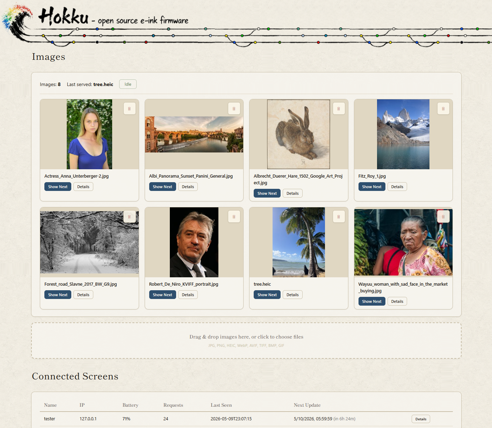

Everything you'd want from a photo frame: accurate colours, full privacy, a clean web app, and the ability to run as many frames as you like from one cheap server. Open source replacement firmware and image server for the Hokku / Huessen 13.3" six-colour e-ink frame.

## Core features

**Photos, your way**
- **Local-only** — your photos never leave your network. No cloud, no third-party servers, no telemetry. The web app itself makes no external requests — fonts and assets are self-hosted, so nothing is phoned home just by opening a browser tab. Your hardware and open source software means you're in full control.
- **Drag-and-drop upload** — single files or dozens at a time, straight into the web app, with a live progress list. Works on phones too.
- **Browse in a grid** — preview exactly what the frame will show before it shows it, original and converted version side by side. Delete anything you don't want with one click.
- **Click any photo** — see how it was processed and compare the original against what's going to the frame at full size.
- **All the formats you actually have** — JPEG, PNG, HEIC/HEIF, AVIF, WebP, GIF, TIFF, BMP. Anything from 90's formats to modern iPhone and Android. Phone photos auto-rotate.
- **Landscape or portrait** — flip a switch and everything re-converts to match how the frame is mounted.
- **Jump the queue** — pick any photo in the library to be the next one shown on the frame.

**Looks good on e-paper**
- **Correct out of the box** — pre-set for the best results on this panel without any tweaking.
- **Adapts to each photo** — it can tell a black-and-white photo from a colour one, and recognise faces (all done locally, nothing leaves your network), and picks the best conversion approach for each automatically.
- **No ugly borders** — photos that are close to the right shape get a subtle crop to fill the screen cleanly instead of showing a letterbox band.
- **Tunable to the nth degree** — three independent conversion profiles (general, black-and-white, faces), 6 presets each, per-photo overrides, and plenty of knobs if you enjoy that sort of thing. ([Details on dithering](docs/dithering.md))
- **Colour-accurate** — calibrated against the actual panel, not a theoretical colour profile.

**Smart about frames**
- **Multiple frames, one server** — each frame gets a name and shows up in a dashboard with battery level, WiFi signal, and when it'll next update.
- **Fair rotation** — every photo gets its turn. Newly uploaded photos go to the front of the queue; after that, whichever image has been shown least goes next.
- **Battery lasts months** — the frame uses almost no power between refreshes. The web app shows a battery level for each frame and flags it red when it's getting low.
- **Problems show up on the screen** — if something goes wrong (wrong WiFi password, server unreachable) the frame displays a plain-English explanation on the e-paper itself instead of going blank. No plugging in a laptop to debug.
- **Late-frame warning** — if a frame misses its scheduled update by more than an hour, the web app flags it so you know to check WiFi or the battery.
- **Scheduled updates** — set the times you want the photo to change (e.g. morning, noon, evening) and the frame wakes up on its own. No constant connection needed.
- **Settings are on the server** — change the schedule, orientation, or anything else in the web app and every frame picks it up automatically. No restarts, no reflashing.
- **Instant refresh** — there's a button on the frame that forces an immediate update whenever you want one.
- **Diagnostics on demand** — one click in the web app shows the frame's status without needing a cable.

**Easy to run**
- **Everything through the web app** — upload, browse, configure. No command line, no shared drives to set up.
- **Fast even on small hardware** — converting a big library of photos uses all available CPU cores and finishes much sooner than doing them one at a time. A Raspberry Pi Zero 2 W handles a multi-frame setup without breaking a sweat.
- **Bad photos are handled gracefully** — if a photo can't be converted, it's set aside with an explanation rather than silently vanishing. You can retry or remove it with one click.
- **Progress while you wait** — a status bar shows how many photos are being converted and roughly how long it'll take.
- **Find it on your network by name** — the server advertises itself as `hokku.local` via mDNS, so you can bookmark `http://hokku.local:8080/` and never chase a changing IP address again.
- **Runs on basically anything, installs in minutes** — a Debian package for Linux that starts automatically, or run from source on macOS, Windows, or a Raspberry Pi. The firmware comes pre-built and the setup wizard flashes it over USB. No build tools, no command line.
- **One-click re-convert** — changed orientation or want to try a different look? One button re-processes everything from scratch.

## The web app

Three tabs: **Images** (your photo library — upload, preview, manage), **Screens** (live status of each frame — battery, WiFi, last seen, next update), and **Config** (refresh schedule, orientation, conversion settings). Everything updates live without a page reload. For a full walkthrough of every feature see the **[user manual](docs/manual.md)**.

## System Requirements

**Server side** — where you host the image server:
- Any Linux, macOS, Windows, or Raspberry Pi. A Raspberry Pi Zero 2 W is more than enough.
- Around 256 MB of RAM. A thousand photos takes a few GB of disk — nothing a basic SD card can't handle.
- On the same local network as the frame. No internet access needed or used.

**Frame side** — the board already inside your Hokku / Huessen frame:
- The frame ships with an ESP32-S3 — the pre-built firmware is matched to it, nothing to worry about.
- A data-capable USB-C cable for the initial setup. Any USB-A-to-C or C-to-C cable that isn't charge-only will do.
- 2.4 GHz WiFi. The frame doesn't support 5 GHz.

## Installation

Hokku loves Pi! Connect both to your computer, run `hokku_setup.bat`, and the guided installer takes care of the rest.

Prefer terminal tabs, mysterious pip errors, and the thrill of doing things the long way? We've got you covered: **[Manual installation guide](docs/install.md)**.

## Buttons and LEDs

**The button** on the back of the frame (right-hand side in landscape, lower side in portrait) forces an immediate refresh — pulls the next image from the server right now, ignoring the schedule. Works whether the frame is deep-asleep on battery, plugged into USB, or anywhere in between.

**Two tiny LEDs** on the bottom of the frame:

- **Red** — blinks when a computer is connected over USB. A plain wall charger won't trigger it, though the battery still charges fine either way.
- **Green** — on while the frame is fetching a new photo over WiFi. Off the rest of the time.

## More Documentation

- **[User manual](docs/manual.md)** — full guide to the web app, frame behaviour, and day-to-day use.
- **[Installation](docs/install.md)** — step-by-step server + firmware setup for those who prefer the scenic route.
- **[Dithering pipeline](docs/dithering.md)** — why it looks the way it does; failure modes and countermeasures.
- **[Firmware documentation](firmware/README.md)** — building from source, manual flashing, developer notes.
- **[Firmware design spec](docs/firmware_design.md)** — the state-machine spec the current firmware implements.
- **[Hardware facts](docs/hardware_facts.md)** — confirmed GPIO map, SPI config, init sequence, USB-detection findings.
- **[Changelog](CHANGELOG.md)** — release history.
- **[Disclaimer](DISCLAIMER.md)** — warranty (none), intended use, reverse-engineering notes, privacy.

## Background

I bought this frame in October 2025 from [Wayfair](https://www.wayfair.com/decor-pillows/pdp/hokku-designs-133-inch-wifi-epaper-art-photo-frame-w115006181.html) for about $280 — the cheapest Spectra 6 e-ink display I could find. The stock firmware didn't reliably update the image and was generally a pain to work with, so it was time to replace it. There's no public documentation on the hardware, so I had to do everything the hard way. Decided to make it an experiment in vibe coding something complex; the repo contains zero lines of human-written code.

Claude Opus 4.6-4.7 was used throughout. Unfortunately, one cannot simply tell AI to build this firmware and hope it works — it takes a lot of pushing, prodding and domain knowledge for it to finally do what I needed it to do. AI proved excellent at analysing the original firmware, but needed a lot of hand-holding when writing the hardware interface. My conclusion is that AI, at the time of building this, is a savant fruitfly with ADHD: absolutely blow-me-away amazing at some things, has no idea what it did a minute ago, plain stupid at times, and way too eager to just _do_ things if you don't hold it in check. Can't recommend a vibe-coding career in embedded software just quite yet :)
