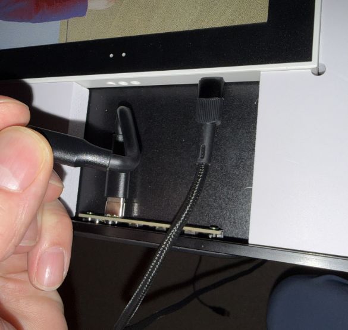

# Hokku/Huessen 13.3" E-Ink Frame open source firmware and image server

Open source firmware and image server for the Hokku / Huessen 13.3" six-color e-ink photo frame.

## Features

- **Web GUI** — configure the server, upload images by drag-and-drop, browse and delete images (with a "Dithering…" badge on freshly-uploaded ones still being converted), manage screens at `http://server:port/`
- **Multi-screen support** — name each frame, track which images they've shown
- **Fair image rotation** — least-shown image served next, new images get priority
- **Server-driven schedule** — configure refresh times on the server, firmware just sleeps
- **EXIF-aware** — phone photos displayed in correct orientation
- **Landscape or portrait** — pick your mounting orientation, server rotates for you
- **Spectra 6 dithering** — Floyd-Steinberg with measured palette values and dynamic range compression - sigificantly better than the factory firmware
- **No cloud, no accounts** — everything runs on your local network

## Getting Started

You need two things:

1. **The image server** running on a computer on your network — serves and dithers your photos
2. **The firmware** flashed to the frame via USB — connects to WiFi and downloads images from the server

### 1. Install the image server

**Debian/Ubuntu** (recommended):
```bash
# Download the .deb from the latest release
apt install ./hokku-server_2.1.5-1_all.deb
# Starts automatically via systemd, web GUI at http://server:8080/
# Drop your photos into /var/lib/hokku/upload/ or install samba
# and make it very easy to manage them from any machine in your network
```

**Any platform** (from source):
```bash
cd webserver
pip install flask pillow numpy pillow-heif
python webserver.py
# Drop your photos into /images/upload/
# Web GUI at http://localhost:8080/
```

### 2. Flash and configure the frame

**Windows** (easiest — requires [Python 3](https://www.python.org/downloads/)):
```
hokku_setup.bat
```
Double-click or run from the command line. It installs dependencies automatically and walks you through WiFi, server address, and screen name.

**Any platform**:
```bash
cd tools
pip install pyserial esptool
python hokku_setup.py
```

The setup tool detects your frame over USB, flashes the firmware, and writes your WiFi credentials — no toolchain or compilation needed.

### How to Flash

To flash the firmware, take off the front cover of the frame (it's magnetically attached, be careful as it's easily damaged) and connect a USB-A to USB-C cable to the ESP32-S3 board's USB-C port as shown below:



Once connected, run `python hokku_setup.py` from the `tools/` directory (or `hokku_setup.bat` on Windows). The setup tool walks you through WiFi credentials, server address, and screen name — then flashes the firmware:


### Image Server

The web GUI lets you manage your image library, configure refresh times, and monitor connected frames. Drop photos into the upload directory and the server automatically converts them to the 6-color e-ink palette:


For more details see:
- **[Image Server documentation](webserver/README.md)** — configuration, web GUI, API endpoints, color correction, systemd service
- **[Firmware documentation](firmware/README.md)** — building from source, manual flashing, developer notes

## Supported Image Formats

JPEG, PNG, BMP, TIFF, WebP, GIF, HEIC/HEIF, and AVIF. Drop any of these into the upload directory and the server auto-converts them.

## How It Works

**Server side:**
1. Images in the upload directory are converted to the 6-color Spectra palette using perceptual Lab color matching and Floyd-Steinberg dithering
2. When a frame requests an image, the server picks the least-shown one and serves it as a 960KB binary with an `X-Sleep-Seconds` header

**Frame side:**
1. Boot, connect to WiFi
2. Download image from server (one HTTP call gets image + sleep duration)
3. Display on the dual-panel e-ink screen (~19 second refresh)
4. Deep sleep until the server-specified time
5. On button press: wake and fetch next image

### Buttons

Press the right-hand button (in landscape) or lower button (in portrait) to wake the frame and fetch the next image.

### LEDs

**Red LED** — solid while awake, blinks at 1Hz while charging (including during the reflash window and any on-USB wait before deep sleep), off once the chip enters real deep sleep

**Green LED** — solid while WiFi is connected. Triple-blinks rapidly if you press the next-image button but the download fails (the current image is kept, the button is not broken)

## Background

I bought this frame in October 2025 from [Wayfair](https://www.wayfair.com/decor-pillows/pdp/hokku-designs-133-inch-wifi-epaper-art-photo-frame-w115006181.html) for about $280 — the cheapest Spectra 6 e-ink display I could find. The stock firmware didn't reliably update the image and was generally a pain to work with, so it was time to replace it. There's no public documentation on the hardware, so I had to do everything the hard way. Decided to made it an experiment in vibe coding something complex; the repo contains zero lines of human-written code. 

Claude Opus 4.6 was used throughout. Unfortunately, one cannot simply tell AI do build this firmware and hope it works, it takes a lot of pushing and prodding and domain knowledge for it to finally do what I needed it to do. AI proved excellent at analyzing the original firmware, but needed a lot of hand-holding when writing the hardware interface. My conclusion is that AI, at the time of building this, is a savant fruitfly with ADHD: absolutely blow me away amazing at some things, has no idea what it did a minute ago, plain stupid at times and overall way too eager to just _do_ things if you don't hold it in check all the time. Can't recomment a vibe-coding career in embedded software just quite yet :)
