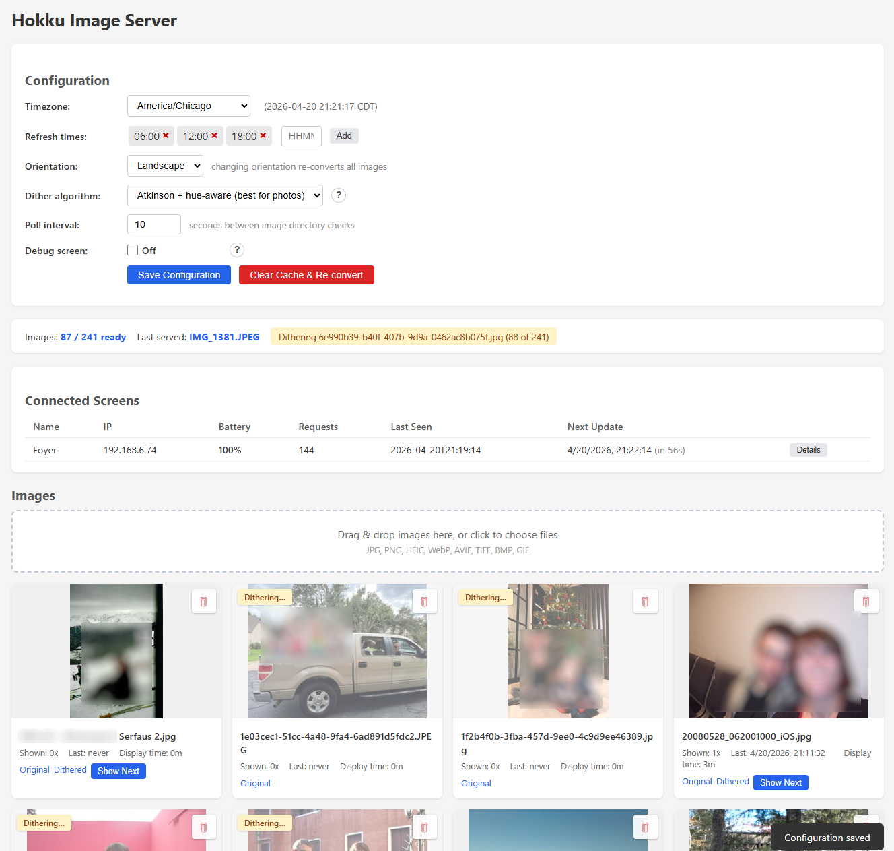

# Hokku / Huessen 13.3" E-Ink Frame — Open Source Firmware & Image Server

Replacement firmware and self-hosted image server for the Hokku / Huessen 13.3" six-colour e-ink photo frame. Runs entirely on your local network — no cloud, no accounts, no third-party servers.



## Features

A self-hosted photo frame that actually works — no cloud, no accounts, no monthly sign-ups you forgot about.

**Photos, your way**
- **Local-only.** Your photos never leave your network. No cloud, no third-party servers, no telemetry.
- **Drag-and-drop upload** straight into the web app — single files or dozens at a time, with a live progress list. Works on phones too.
- **Browse in a grid**, preview originals *and* the dithered version side-by-side (so you see exactly what the frame will show before it shows it), delete anything you don't want with a one-click trash button.
- **All the formats you actually have:** JPEG, PNG, HEIC/HEIF, AVIF, WebP, GIF, TIFF, BMP. Phone photos auto-rotate thanks to EXIF.
- **Landscape or portrait** — flip a switch, the server re-dithers everything to match the mounting.
- **"Show next" on any image** when you want to force a specific photo onto the frame at the next refresh.

**Looks good on e-paper**
- **Three dither algorithms to choose from**, including a hue-aware Atkinson recipe that handles skin tones and whites without the usual blue-speckle / pink-noise failure modes. ([the dithering rabbit hole →](docs/dithering.md))
- **Calibrated to real Spectra 6 panel colours**, not theoretical sRGB, for accurate rendering.

**Smart about frames**
- **Multiple frames, one server.** Each frame gets a name and shows up in a dashboard table with battery level, last-seen time, WiFi signal, and when it'll next update.
- **Fair image rotation** — least-shown image goes next, randomised tie-breaking, newly-uploaded photos jump to the front.
- **Per-image stats** (shown count, total display time, last-seen) so you can see which shots are getting the most air time.
- **Ultra-low power on battery** — ~8 µA in deep sleep, so a full charge lasts months. Live battery indicator per frame on the web app (red below 20 %) so you know when to plug in.
- **Errors show up on the screen.** If something goes wrong — wrong WiFi password, server unreachable, configuration missing — the frame renders a readable explanation right on the e-paper instead of silently giving up. No serial-cable debugging required.
- **Overdue-frame warning** banner if a frame is more than an hour late on its scheduled refresh — so you know to check WiFi or the battery before you notice a stale photo on the wall.
- **Schedule-driven refreshes** (e.g. 06:00, 12:00, 18:00) with timezone support; the frame sleeps between refreshes and wakes on its own.
- **Clock-synced** — every refresh carries the server's wall-clock, and the dashboard shows drift in seconds for every frame.
- **Per-frame diagnostics modal** — one click opens the frame's self-reported state (firmware version, boot count, wake cause, WiFi cache hit, free heap, etc.) without a serial cable.
- **Button on the side** forces an immediate refresh regardless of schedule.

**Easy to run**
- **Upload, download and manage everything from the web app.** No extra servers, no Linux config, no Samba share to mount. Just works out of the box.
- **Runs happily on a Raspberry Pi.** Hundreds of 20+ MP photos, dithered once and served from cache thereafter — the per-request load is a file-copy, not image processing. A Pi Zero 2 W handles a multi-frame setup without breaking a sweat.
- **Debian package** with a systemd service for a one-line install, or run from source on any Python 3.9+ host (Linux, macOS, Windows, Raspberry Pi).
- **Pre-built firmware + a wizard flasher** — no ESP-IDF toolchain required. Walks you through WiFi, server address, and naming in a few clicks.
- **Configuration lives on the server** (timezone, schedule, orientation, dither choice) — change it once in the web app, every frame picks it up on its next refresh.
- **Clear Cache & Re-convert** one-click button for when you change orientation, dither algorithm, or want to re-render everything from scratch.

## System Requirements

**Server side** — where you host the image server:
- Any Linux, macOS, Windows, or Raspberry Pi host with Python 3.9+.
- ~256 MB of RAM is plenty. Dithering a fresh upload briefly peaks a little higher while Pillow decodes the source, but it's single-threaded, transient, and you can feed it a slow machine.
- Disk: ~2 MB per image for the dithered cache + preview + thumbnail, plus however big your originals are. A thousand photos fits comfortably on any SD card.
- Networking: anywhere on the same LAN as the frame. No open-internet access needed.

**Frame side** — the ESP32-S3 board already inside your Hokku / Huessen frame:
- ESP32-S3 with 16 MB flash and 8 MB octal PSRAM. This is what ships in the frame — the pre-built firmware matches.
- One USB-C cable (any USB-A-to-C or C-to-C works) for first-time flashing and re-configuration.
- 2.4 GHz WiFi (open / WPA2 / WPA3). 5 GHz not supported by the chip.

## Installation

You need two things running:

1. **The image server**, on a computer on your network.
2. **The firmware**, flashed onto the frame over USB.

### 1. Install the image server

**Debian / Ubuntu** (recommended):
```bash
# Download the .deb from the latest release, then:
apt install ./hokku-server_2.1.19-1_all.deb
```
Starts automatically via systemd. Web GUI at `http://<your-server>:8080/`. Use web upload, drop photos into `/var/lib/hokku/upload/` — or install Samba so you can manage that folder from any machine on your network.

**Any platform** (from source):
```bash
cd webserver
pip install flask pillow numpy pillow-heif
python webserver.py
```
Photos go in `/images/upload/`. Web GUI at `http://<your-server>:8080/`.

### 2. Flash and configure the frame

1. Take off the front cover — it's magnetically attached, be careful, it damages easily.
2. Connect a USB-C cable from your computer to the board on the back.
3. Run the setup tool:

   **Windows** (easiest — just double-click):
   ```
   hokku_setup.bat
   ```

   **Any platform**:
   ```bash
   cd tools
   pip install pyserial esptool
   python hokku_setup.py
   ```

The setup tool walks you through WiFi, the server address, and a name for this frame. It flashes the firmware and writes the configuration over USB — no toolchain or compilation needed.


Once configured, the frame will fetch its first image and then settle into its refresh schedule.

## Buttons and LEDs

**The button** on the back of the frame (right-hand side in landscape, lower side in portrait) forces an immediate refresh — pulls the next image from the server right now, ignoring the schedule. Works whether the frame is deep-asleep on battery, plugged into USB, or anywhere in between.

**Two tiny LEDs** on the bottom of the frame:

- **Red** — blinks at 1 Hz whenever a USB host (computer) is plugged in. Off on battery. This is a "host is present" indicator rather than a strict "charging" one — a dumb wall charger doesn't trigger it, although the battery still charges in the background.
- **Green** — solid while the frame is talking to WiFi during a refresh. Otherwise off.

## Supported Image Formats

JPEG, PNG, BMP, TIFF, WebP, GIF, HEIC/HEIF, AVIF. Drop any of these into the upload directory or into the web gui and the server takes care of the rest.

## More Documentation

- **[Technical details](docs/tech_details.md)** — state machine, REST API, hardware map, firmware internals.
- **[Image server documentation](webserver/README.md)** — install, web GUI, API endpoints, systemd service.
- **[Dithering pipeline](docs/dithering.md)** — why it looks the way it does; failure modes and countermeasures.
- **[Firmware documentation](firmware/README.md)** — building from source, manual flashing, developer notes.
- **[Firmware design spec](docs/firmware_design.md)** — the state-machine spec the current firmware implements.
- **[Hardware facts](docs/hardware_facts.md)** — confirmed GPIO map, SPI config, init sequence, USB-detection findings.
- **[Changelog](CHANGELOG.md)** — release history.
- **[Disclaimer](DISCLAIMER.md)** — warranty (none), intended use, reverse-engineering notes, privacy.

## Background

I bought this frame in October 2025 from [Wayfair](https://www.wayfair.com/decor-pillows/pdp/hokku-designs-133-inch-wifi-epaper-art-photo-frame-w115006181.html) for about $280 — the cheapest Spectra 6 e-ink display I could find. The stock firmware didn't reliably update the image and was generally a pain to work with, so it was time to replace it. There's no public documentation on the hardware, so I had to do everything the hard way. Decided to make it an experiment in vibe coding something complex; the repo contains zero lines of human-written code.

Claude Opus 4.6-4.7 was used throughout. Unfortunately, one cannot simply tell AI to build this firmware and hope it works — it takes a lot of pushing, prodding and domain knowledge for it to finally do what I needed it to do. AI proved excellent at analysing the original firmware, but needed a lot of hand-holding when writing the hardware interface. My conclusion is that AI, at the time of building this, is a savant fruitfly with ADHD: absolutely blow-me-away amazing at some things, has no idea what it did a minute ago, plain stupid at times, and way too eager to just _do_ things if you don't hold it in check. Can't recommend a vibe-coding career in embedded software just quite yet :)
