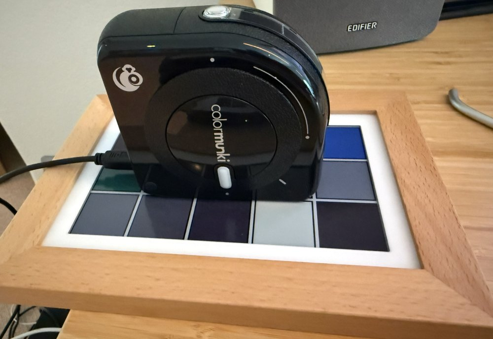
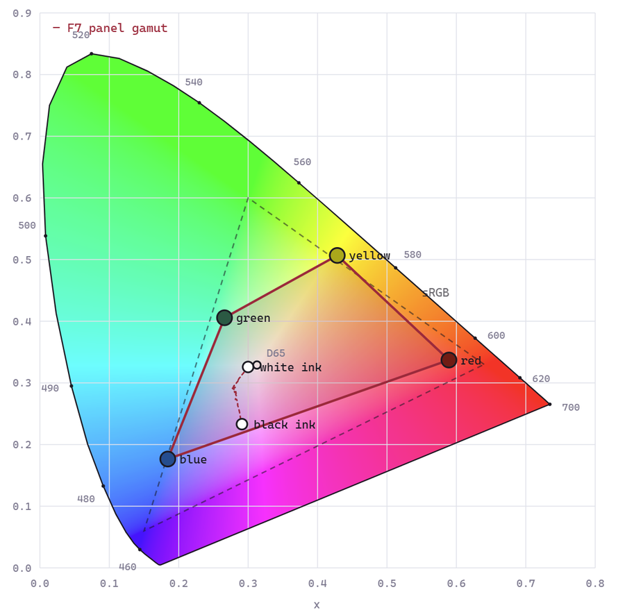
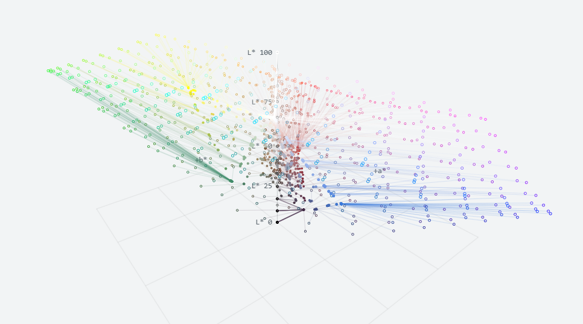
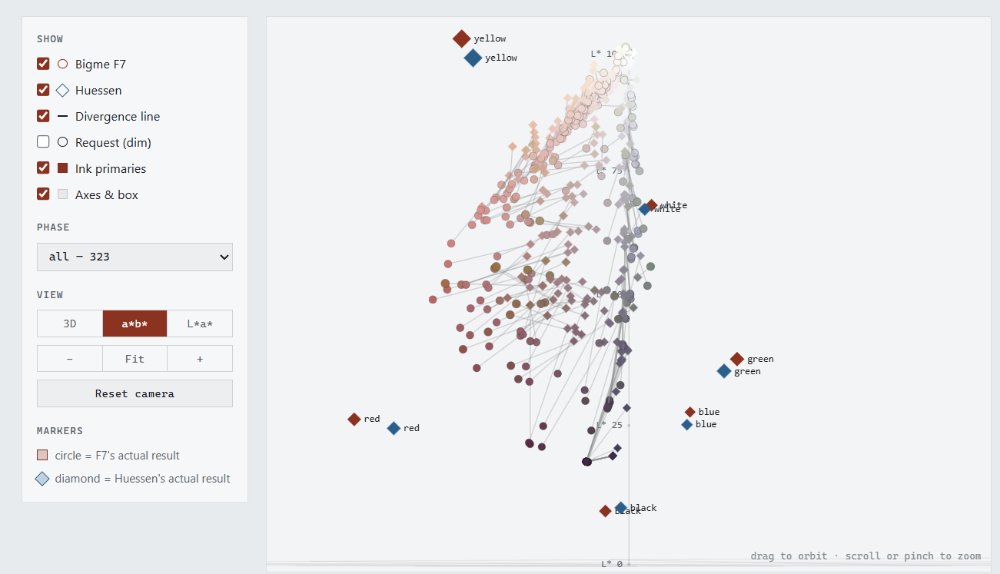
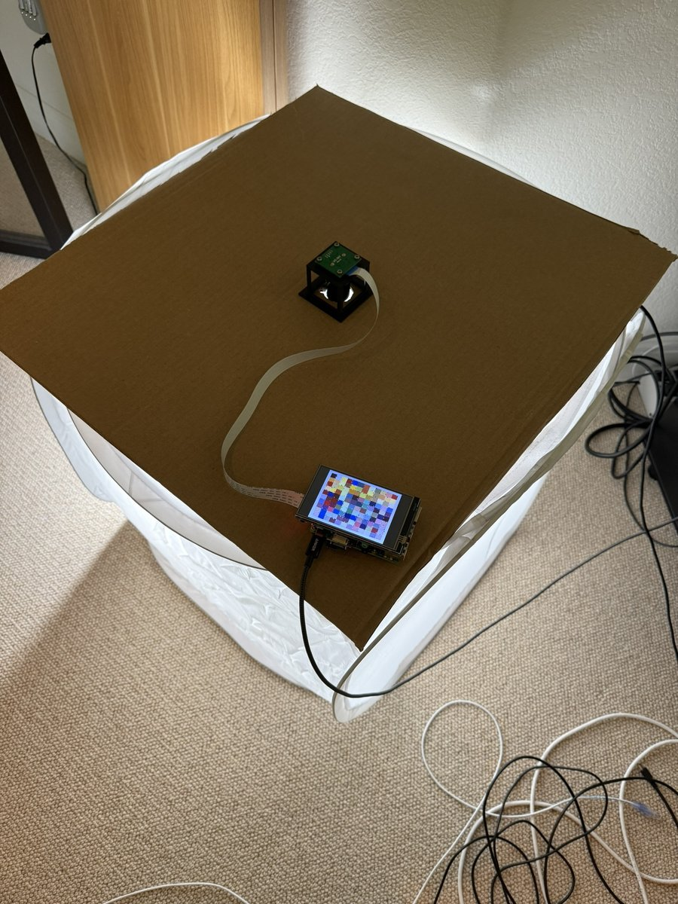
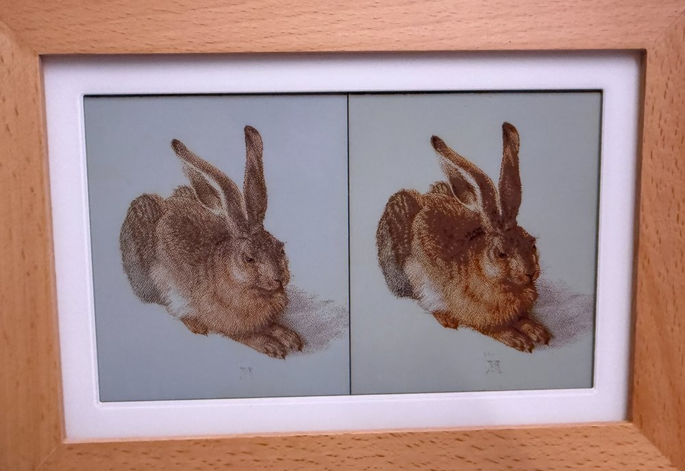

# Colour accuracy

The panel settings aren't copied from a spec sheet; they come from measuring real panels. This page tells the story of how the shipped tuning was reached. To measure a panel yourself, see [Measuring a panel's colour with a colorimeter](color_calibration.md).

## Measuring the panel

It started with a colorimeter sitting on the glass, reading well over a thousand test patches to map what each panel can actually show:

<table>
<tr>
<td></td>
<td></td>
</tr>
<tr>
<td>A colorimeter reading test patches off the Bigme F7.</td>
<td>The F7's six inks against sRGB. E-ink covers a lot less colour than a monitor.</td>
</tr>
<tr>
<td></td>
<td></td>
</tr>
<tr>
<td>Requested colour → measured colour. Each line is how far the panel lands from what was asked for.</td>
<td>Bigme F7 vs. Hokku / Huessen: nearly the same screen, and the cheaper one comes out slightly ahead.</td>
</tr>
</table>

## Judging real photographs

Patch measurements alone only got so far, so the rig grew a high-resolution camera looking down at the panel under a full-spectrum, high-CRI light. Thousands of captured images and a long game of left-or-right comparisons later, the result is the tuning that shipped in 4.0 beta 3:

<table>
<tr>
<td></td>
<td></td>
</tr>
<tr>
<td>The camera rig: a light tent with the camera on top.</td>
<td>One of the A/B comparisons, two renderings side by side on the same panel.</td>
</tr>
</table>

## Further reading

The full story, with interactive 3D plots, is in the discussions [Let's get the colors as right as we can](https://github.com/defl/hokku_epaper/discussions/38) and [Camera based coloring improvements](https://github.com/defl/hokku_epaper/discussions/42).
