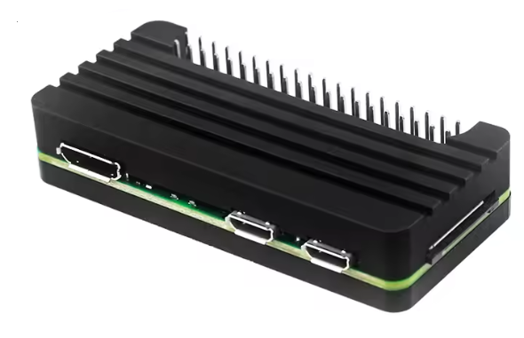

# Hardware

## The Frame

This project is built for the **Hokku Designs / Huessen 13.3" WiFi E-Paper Art Photo Frame** — a six-colour Spectra 6 e-ink display with an ESP32-S3 inside. It is sold under two brand names depending on the retailer: **Hokku Designs** and **Huessen**. The hardware is identical.

The following retailers stock it. The Wayfair listing is the one confirmed to contain the exact hardware this firmware targets. The others are likely the same but have not been independently verified.

| Retailer | Listing | Price | Confirmed |
|----------|---------|------:|:---------:|
| Wayfair | [Hokku Designs 13.3" WiFi E-Paper Art Photo Frame](https://www.wayfair.com/decor-pillows/pdp/hokku-designs-133-inch-wifi-epaper-art-photo-frame-w115006181.html) | $280 | ✓ |
| Macy's | [Huessen 13.3" WiFi E-Paper Art Digital Photo Frame](https://www.macys.com/shop/product/huessen-13.3-inch-wifi-epaper-art-digital-photo-frame?ID=23769763) | $320 | |
| Best Buy | [Huessen 13.3" WiFi E-Paper Art Photo Frame](https://www.bestbuy.com/product/huessen-13-3-inch-wifi-epaper-art-photo-frame/J3KVWY3Q9L) | $350 | |
| eco4life | [13.3" WiFi E-Ink Art Photo Frame](https://mall.eco4lifehome.com/products/13-3-inch-wifi-e-ink-art-photo-frame-smart-epaper-digital-display-with-app-control-cloud-sync-no-glare-no-light-pollution-ultra-low-power-ideal-for-home-office-decor) | $380 | |

If you buy one of the unconfirmed listings above — or find the frame somewhere else entirely — please [open a GitHub issue](https://github.com/defl/hokku_epaper/issues) with what you bought and whether it worked. I'll add it to the list either way.

### What to check before buying

- **Size**: 13.3". Smaller or larger frames from the same brand family are different hardware and are not compatible with this firmware.
- **Six colours**: the listing should mention red, yellow, blue, and green in addition to black and white. Frames with only black and white, or black/white/red, use a different display technology and are not compatible.
- **WiFi**: confirmed 2.4 GHz. The frame does not support 5 GHz networks.

---

## The Server

The image server will run on almost anything — a cheap ARM board, a spare laptop, a NAS, a desktop, or a server-grade machine. The only hard requirement is **512 MB of RAM**. If you have a spare computer sitting around, that's your server.

If you want to buy something new, the cheapest route is AliExpress — ARM boards and accessories go for a fraction of the prices below. The trade-off is weeks of shipping and variable quality. If you're in the US and want something in your hands tomorrow from reputable brands, the following list is the recommended build:

| Item | Link | Price |
|------|------|------:|
| Raspberry Pi Zero 2 W (board + essentials kit) | [Amazon](https://www.amazon.com/gp/product/B0DRRRZBMP/) | $42 |
| Aluminium case with passive cooling and 4-port USB hub | [Amazon](https://www.amazon.com/gp/product/B0FSYKVNBV/) | $9 |
| Official Pi power supply (5.1 V / 2.5 A) | [Amazon](https://www.amazon.com/gp/product/B09XN7H9M8/) | $22 |
| USB-C cable (data-capable, for flashing the frame) | [Amazon](https://www.amazon.com/gp/product/B0BDLYW7CN/) | $10 |
| SanDisk 64 GB microSD card | [Amazon](https://www.amazon.com/SANDISK-Ultra-microSD-UHS-I-SDSQUJQ-064G-GZ6MA/dp/B0G8KLQ64L/) | $24 |
| USB SD card reader | [Amazon](https://www.amazon.com/eTECH-Collection-Memory-Reader-Writer/dp/B07GHT8SY3/) | $4 |
| **Total** | | **$111** |

A few notes:

- The kit (row 1) includes the Pi Zero 2 W board, header, heatsink, USB cable, and HDMI adapter.
- The case (row 2) does **not** include the board — it pairs with the kit above.
- The USB-C cable must be data-capable (not charge-only). The linked cable supports 10 Gbps / 3 A and works reliably for flashing.

---

> Prices last checked 2026-05-12. Amazon prices fluctuate; the frame price varies by retailer and sale.
