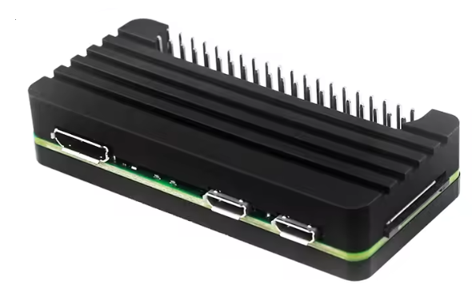

# Hardware

What Hokku runs on: one or more **e-paper frames**, and one **server** that feeds
them. You can mix different frame models against the same server and the same
photo library.

## Supported frames

| Frame | Size | Panel | Board | Status |
|---|---|---|---|---|
| [**Hokku / Huessen 13.3"**](#hokku--huessen-133) | 13.3" | Spectra 6, 1200×1600 | ESP32-S3 | ✅ Fully supported — the original, most thoroughly tested |
| [**Bigme F7**](#bigme-f7) | 7.3" | Spectra 6, 800×480 | XR872AT | ✅ Supported — proven end-to-end on real hardware |
| [**Seeed reTerminal E1004**](#seeed-reterminal-e1004) | 13.3" | Spectra 6, 1200×1600 | ESP32-S3 | ⚠️ Experimental — builds and passes tests, **never run on real hardware** |

All three use **E Ink Spectra 6** — the same six-ink family (black, white, yellow,
red, blue, green), so the same photo library and conversion pipeline serves all of
them.

---

## Hokku / Huessen 13.3"

The frame this project started with, and the one with the most hours on it. Sold
under both the **Hokku Designs** and **Huessen** brands — identical hardware,
different retailer.

The Wayfair listing is the one confirmed to contain the exact hardware this
firmware targets; the others are likely the same but have not been independently
verified.

| Retailer | Listing | Price | Confirmed |
|----------|---------|------:|:---------:|
| Amazon | [Hokku Designs 13.3" WiFi E-Paper Art Photo Frame](https://amzn.to/3Rs4DXs) | | |
| Wayfair | [Hokku Designs 13.3" WiFi E-Paper Art Photo Frame](https://www.wayfair.com/decor-pillows/pdp/hokku-designs-133-inch-wifi-epaper-art-photo-frame-w115006181.html) | $280 | ✓ |
| Macy's | [Huessen 13.3" WiFi E-Paper Art Digital Photo Frame](https://www.macys.com/shop/product/huessen-13.3-inch-wifi-epaper-art-digital-photo-frame?ID=23769763) | $320 | |
| Best Buy | [Huessen 13.3" WiFi E-Paper Art Photo Frame](https://www.bestbuy.com/product/huessen-13-3-inch-wifi-epaper-art-photo-frame/J3KVWY3Q9L) | $350 | |
| eco4life | [13.3" WiFi E-Ink Art Photo Frame](https://mall.eco4lifehome.com/products/13-3-inch-wifi-e-ink-art-photo-frame-smart-epaper-digital-display-with-app-control-cloud-sync-no-glare-no-light-pollution-ultra-low-power-ideal-for-home-office-decor) | $380 | |

**What to check before buying**

- **Size**: 13.3". Smaller or larger frames from the same brand family are different hardware and are not compatible.
- **Six colours**: the listing should mention red, yellow, blue and green as well as black and white. Black/white or black/white/red frames use different display technology and are not compatible.
- **WiFi**: 2.4 GHz. The frame does not support 5 GHz networks.

**→ [Full documentation for this screen](screens/huessen_epf1301/README.md)**

---

## Bigme F7

The cheapest way into Hokku, and the only non-ESP32 frame supported: it runs an
**XRADIOTECH XR872AT**, which took a full reverse-engineering effort to support
(see the [reverse-engineering overview](screens/bigme_f7/reverse_engineering_overview.md)).
Custom firmware, A/B OTA updates, battery reporting and mDNS all work — proven
end-to-end on real hardware.

**Any F7 variant works.** Bigme sells the F7, F7 Lite, F7 Plus, F7 Pro, F7 Max,
F7 Ultra, F7 SE and F7+ — per the manufacturer's own FCC equivalence letter
(FCC ID `2A8EM-F7`) these **share identical PCB and hardware** and differ only by
sales region. Buy whichever variant is cheapest or available where you are.

| Retailer | Listing |
|----------|---------|
| Amazon | [Bigme F7 7.3" colour e-ink frame](https://amzn.to/4wL9dPm) |

Made by Bigme Cloud Literacy Technology Co., Ltd.; also sold directly and through
the usual marketplaces.

**→ [Full documentation for this screen](screens/bigme_f7/README.md)**

> **Read before you buy:** turning a stock F7 into a Hokku frame requires a
> one-time USB flash that replaces the vendor firmware, and it is a more involved
> process than the ESP32 frames — see
> [Bigme F7 bootstrap](screens/bigme_f7/bootstrap.md). Going back to stock is
> documented in [restore to stock](screens/bigme_f7/restore_to_stock.md), but
> treat this as a one-way trip unless you're comfortable with the recovery
> procedure.

---

## Seeed reTerminal E1004

> ⚠️ **Experimental — not hardware-verified.** The firmware compiles, links
> against the real ESP-IDF toolchain in CI, and passes the host test suite, but
> **it has never been flashed to a physical E1004.** The panel registers and
> pinout come from Seeed's own driver and a community Arduino port; the ESP-IDF
> SPI/DMA plumbing and the battery divider ratio are unverified on silicon. If
> you own one, [we'd love to hear how it goes](https://github.com/defl/hokku_epaper/issues).

A 13.3" Spectra 6 panel on a Seeed XIAO ESP32-S3, on the reTerminal E-Series
baseboard. Same panel family and resolution as the Hokku/Huessen frame.

| Retailer | Listing |
|----------|---------|
| Seeed Studio | [reTerminal E1004](https://www.seeedstudio.com/reTerminal-E1004-p-6692.html) |

The panel bring-up work this port is based on was contributed by
[@TaichungLester](https://github.com/TaichungLester) in
[PR #16](https://github.com/defl/hokku_epaper/pull/16).

**→ [Full documentation for this screen](screens/seeedstudio_e1004/README.md)**

---

## The Server

The image server runs on almost anything — a cheap ARM board, a spare laptop, a
NAS, a desktop. The only hard requirement is **512 MB of RAM**, plus a few GB of
disk for photos. If you have a spare computer sitting around, that's your server.

A **Raspberry Pi Zero 2 W** is the recommended choice: cheap, silent, uses almost
no power, and fast enough for a multi-frame setup. It's also the board the
[appliance image](appliance.md) is built for — write one file to an SD card and
the whole setup is a web form.

If you want to buy something new, the cheapest route is AliExpress — ARM boards
and accessories go for a fraction of the prices below, at the cost of weeks of
shipping and variable quality. If you're in the US and want it tomorrow from
reputable brands, this is the recommended build:

| Item | Link | Price |
|------|------|------:|
| Raspberry Pi Zero 2 W (board + essentials kit) | [Amazon](https://amzn.to/4wz5jtY) | $42 |
| Aluminium case with passive cooling and 4-port USB hub | [Amazon](https://amzn.to/4eLkzxk) | $9 |
| Official Pi power supply (5.1 V / 2.5 A) | [Amazon](https://amzn.to/4uhEbhy) | $22 |
| USB-C cable (data-capable, for flashing a frame) | [Amazon](https://amzn.to/4wAjkrh) | $10 |
| SanDisk 64 GB microSD card | [Amazon](https://amzn.to/4dpocGI) | $24 |
| USB SD card reader | [Amazon](https://amzn.to/49K7pwY) | $4 |
| **Total** | | **$111** |

A few notes:

- The kit (row 1) includes the Pi Zero 2 W board, header, heatsink, USB cable, and HDMI adapter.
- The case (row 2) does **not** include the board — it pairs with the kit above.
- The USB-C cable must be data-capable (not charge-only). The linked cable supports 10 Gbps / 3 A and works reliably for flashing.

> The Amazon links on this page — both the kit above and the frame listings — are affiliate links. Clicking them costs you absolutely nothing extra: the price is identical either way. I get a few percent from Amazon, and if enough people do this, maybe one day there'll be enough in the jar to add the next screen to the lineup.

---

## Anything else?

**2.4 GHz WiFi is required.** None of the supported frames — and not the Pi Zero
2 W — support 5 GHz. Most routers broadcast both; either SSID is fine as long as
2.4 GHz is enabled.

**A data-capable USB cable** is needed for the one-time firmware flash. Charge-only
cables are common and won't work; if nothing appears when you plug in, try
another cable.

If you buy from a listing not covered here — or get a frame working that isn't on
this page at all — please [open an issue](https://github.com/defl/hokku_epaper/issues)
with what you bought and whether it worked. It'll get added either way.

---

> Prices last checked 2026-05-12. Amazon prices fluctuate; frame prices vary by
> retailer and sale.
