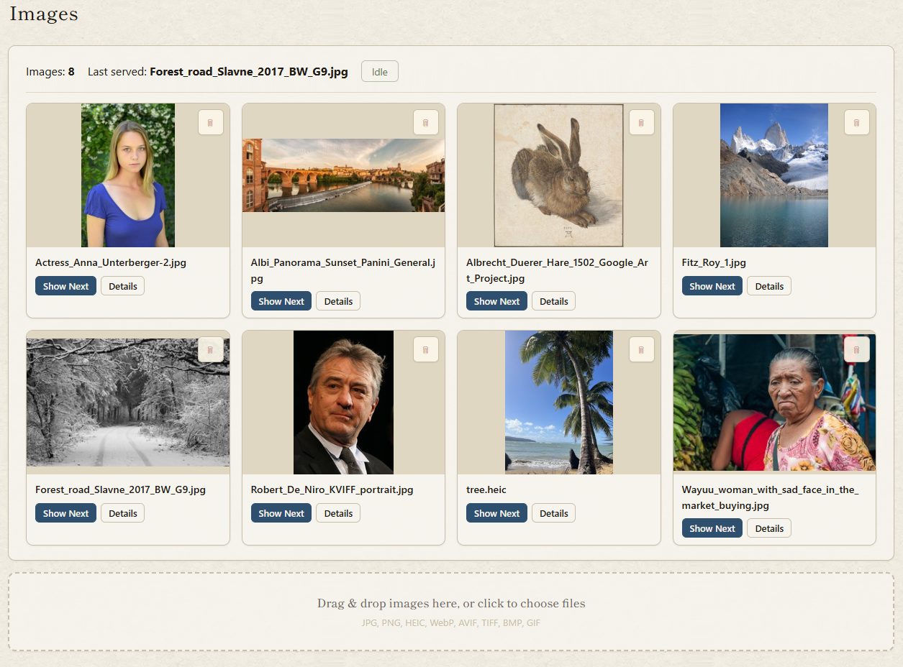
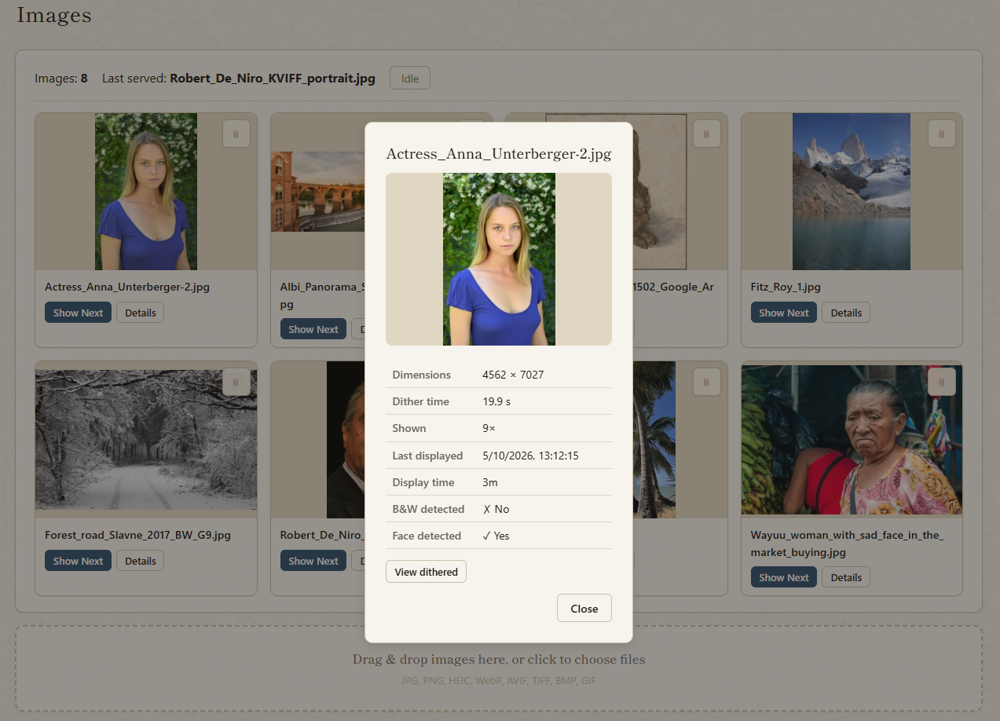
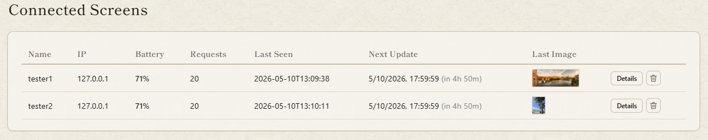
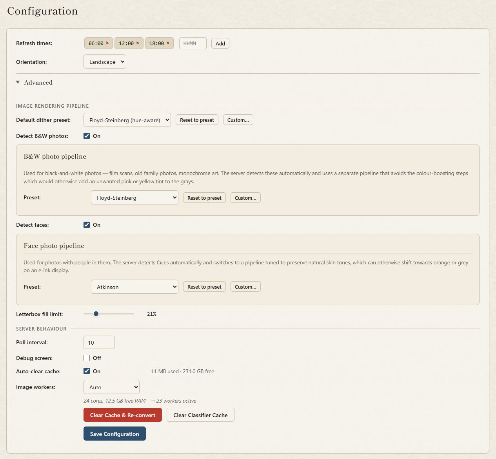
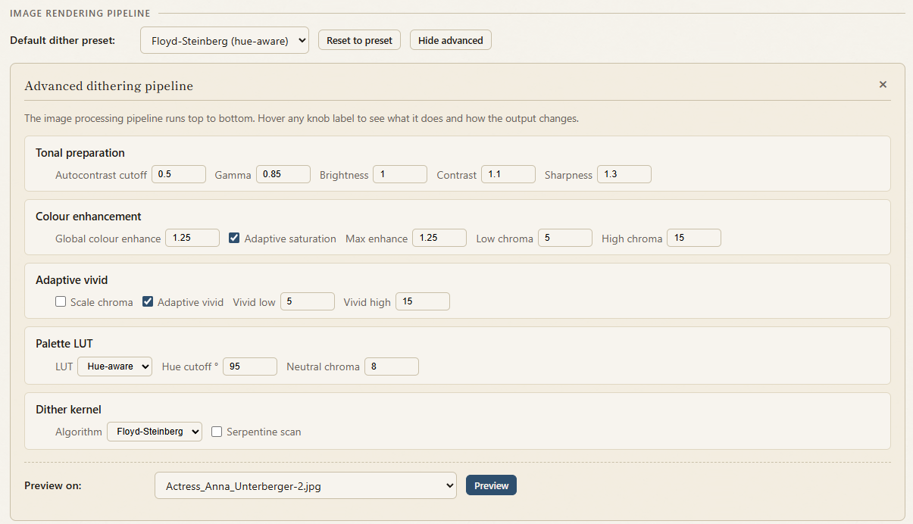

# User Manual

This manual covers the web app, the frame's day-to-day behaviour, and where to find more detail. For installation and first-time setup see [install.md](install.md).

## Contents

1. [The web app](#1-the-web-app)
   - [1.1 Images](#11-images)
   - [1.2 Screens](#12-screens)
   - [1.3 Config](#13-config)
2. [The frame itself](#2-the-frame-itself)
   - [2.1 Buttons and LEDs](#21-buttons-and-leds)
   - [2.2 Error messages](#22-error-messages)
   - [2.3 Sleep and power](#23-sleep-and-power)
3. [Going deeper](#3-going-deeper)

---

## 1. The web app

The web app is your control centre for everything. Open it at `http://<your-server>:8080/` from any browser on your network — phone, tablet, or desktop. It has three sections accessible from the navigation bar at the top.

### 1.1 Images

The Images tab is your photo library. Every photo you've uploaded appears here as a thumbnail showing the converted version — what the frame will actually display, not the original. This matters because e-ink has only six colours and images are converted using a dithering process that can look quite different from the original on certain types of photo. Seeing the result before it goes on the wall is one of the key reasons to use this software over the stock firmware.

**Uploading photos** — drag files anywhere onto the page, or click the upload zone to browse. You can drop dozens of files at once; a live list shows each file's progress as it uploads. The server accepts JPEG, PNG, HEIC/HEIF, AVIF, WebP, GIF, TIFF, and BMP — anything from old scanned prints to recent iPhone photos. Phone photos are automatically rotated to match their EXIF orientation tag, so a portrait shot taken on a phone doesn't arrive sideways.

**Conversion** — after uploading, each image is converted to the frame's six-colour palette in the background. This takes a few seconds per image depending on your server hardware. While conversion is in progress a status strip at the top of the page shows how many images are queued and a rough time estimate. You don't need to wait — the page updates live and thumbnails appear as each conversion finishes.

The conversion process is smarter than a simple filter. The server analyses each image before converting it: black-and-white photos are detected and routed through a pipeline tuned for monochrome, and photos containing faces get special treatment to preserve skin tones. All of this runs entirely on your server — nothing is sent anywhere. For a full explanation of how the conversion pipeline works and why certain choices were made, see [dithering.md](dithering.md).

**Failed conversions** — occasionally an image can't be converted, usually because the file is corrupt, too large to decode within the memory budget, or in a format the server doesn't fully support. These don't silently disappear: they appear in a separate Failed panel below the grid with the error message and the filename. You can delete individual failed entries or clear them all at once, and retry if you think the error was transient.

**Previewing** — click any thumbnail to open the details view.

The details view shows the original and the converted version side by side at full size, so you can judge exactly how well the conversion worked for that particular photo. It also shows the source dimensions, which conversion algorithm was used (the server picks automatically, but you can override per-image in Config), and how long the conversion took. If the converted version doesn't look right you can adjust the dither preset in Config and use the Clear Cache & Re-convert button to regenerate everything.

**Queue control** — each thumbnail has a "Show next" button that immediately queues that photo to be shown on the frame at its next refresh. Use this when you want a specific photo on the wall without waiting for normal rotation. The server uses a fair rotation algorithm — each image gets equal screen time over the long run, with newly uploaded photos jumping to the front of the queue. The "Show next" button effectively sets an image's priority to maximum.

**Deleting** — the trash button on each thumbnail deletes the original and all cached conversions. The frame will never show that image again.

### 1.2 Screens

The Screens tab shows every frame that has ever connected to this server. Each entry in the dashboard displays:

- **Name** — the screen name you gave the frame during setup. If you have multiple frames this is how you tell them apart.
- **Battery level** — shown as a percentage with a colour indicator. Drops below 20% and it turns red. The frame reports its battery level on every refresh so this is always current as of the last check-in.
- **WiFi signal** — the frame's signal strength at the time of its last refresh. Useful for diagnosing frames that are inconsistent updaters.
- **Last seen** — when the frame last fetched an image. If this is hours ago and the frame is supposed to be on a regular schedule, something is probably wrong.
- **Next update** — when the server expects the frame to check in next, calculated from the refresh schedule and the sleep duration the server told it to use. A frame that hasn't appeared by this time gets flagged with an overdue warning.
- **Diagnostics** — a one-click modal that shows the frame's self-reported state: firmware version, boot count, wake cause (timer vs button), free memory, and more. Useful for diagnosing problems without needing a serial cable.

**How frames connect** — the frame calls the server on its refresh schedule, receives the next image and a sleep duration in the response headers, and goes back to deep sleep. It doesn't maintain a persistent connection. This means the Screens table only updates when a frame checks in — a frame that's been asleep for 12 hours will show its last-seen time as 12 hours ago. That's normal.

**Multiple frames** — every frame that connects is tracked independently. You can run as many frames as you like from a single server. Give each one a distinct name during setup so you can tell them apart in the dashboard. Each frame follows the same global refresh schedule and image pool unless you configure per-frame overrides.

### 1.3 Config

The Config tab controls how the server behaves and how images are converted. All changes take effect immediately — there's no save-and-restart cycle, and the frame picks up any configuration changes on its next scheduled refresh without reflashing.

**Refresh times** — the list of times during the day when each frame should fetch a new image. Add times in HH:MM format; the frame wakes up on its own at these times and goes back to sleep after fetching. The server calculates the sleep duration based on your timezone (set on the server OS, not here) and sends it to the frame as part of every response. Outside of scheduled refresh times the frame draws no meaningful power — see [Sleep and power](#33-sleep-and-power).

**Orientation** — landscape or portrait, matching how your frame is mounted. Changing this re-converts all images automatically. You don't need to re-upload anything.

**Image workers** — how many photos the server converts in parallel. Set to Auto and the server picks based on available CPU cores and memory. Set it higher on a faster machine to convert large libraries faster; set it to 1 on very constrained hardware. Each worker uses around 50 MB of RAM during conversion.

**Crop to fill** — when a photo's aspect ratio is close to the frame's but not exact, the server can crop slightly rather than showing a thin letterbox band. The threshold controls how much cropping is acceptable (e.g. 0.05 = up to 5%). Set to 0 to always letterbox. See [dithering.md](dithering.md) for more detail on how this interacts with the conversion pipeline.

**Dither preset** — six presets covering common use cases, from a faithful general-purpose conversion to modes optimised for high contrast, soft tones, or vivid colours. There are three independent preset slots: one for general images, one for detected black-and-white photos, and one for detected faces — so you can use a high-contrast monochrome preset for B&W shots while keeping a softer general preset for everything else. The server also exposes individual knobs for users who want to tune beyond the presets. Changing any preset doesn't automatically re-convert existing images — use the **Clear Cache & Re-convert** button to regenerate everything with the new settings. For a full explanation of what each setting does and the reasoning behind the defaults, see [dithering.md](dithering.md).

**Context-aware conversion** — two toggles control whether the server analyses image content before choosing a conversion approach. B&W detection identifies monochrome photos and routes them through a separate pipeline tuned for black-and-white rather than colour dithering. Face detection identifies photos containing faces and routes them through a pipeline that prioritises skin tone rendering. Both run entirely locally using on-device models — nothing leaves your network. You can disable either toggle if you prefer a single consistent approach across all images, or if the detection is occasionally misclassifying something.

**Poll interval** — how often the web app checks the server for status updates (queue progress, new images, screen check-ins). Default is 10 seconds. Raise it if you want to reduce network chatter on a slow connection; lower it if you want near-instant updates during large uploads.

**Clear Cache & Re-convert** — wipes all converted images and regenerates them from the originals using the current settings. Use this after changing orientation, dither preset, or crop-to-fill threshold. The process runs in the background; the status strip on the Images tab shows progress.

**Config file options** — a few settings can't be changed from the web app and need to be edited in the config file directly (`/var/lib/hokku/config.json` on a deb install, or `./config.json` from source). These are:

- **`mdns_hostname`** — the mDNS/Bonjour hostname the server advertises on your network. When set (default: `"hokku"`), the server is reachable as `hokku.local` in addition to its IP address, which means you can bookmark `http://hokku.local:8080/` and never worry about the IP changing. Set to an empty string to disable mDNS.
- **`port`** — the port the server listens on (default: `8080`). Change this if something else on your server is already using 8080.
- **`upload_dir`** / **`cache_dir`** — where originals and converted images are stored. The defaults are sensible for a deb install; override these if you want to put your photo library on a different drive or mount point.

After editing the config file, restart the server (`systemctl restart hokku-server`) for changes to take effect.

---

## 2. The frame itself

### 2.1 Buttons and LEDs

**The button** on the side of the frame (right side in landscape orientation, bottom in portrait) forces an immediate refresh regardless of schedule. The frame wakes up, connects to WiFi, fetches the next image, displays it, then goes back to sleep. This works whether the frame is running on battery or plugged into USB. Use it when you've just uploaded something and want to see it on the frame right now rather than waiting for the next scheduled time.

After a button press the frame stays awake for 60 seconds — long enough to press the button again to skip to another image, or to plug in USB for reflashing if needed.

**Two tiny LEDs** on the bottom edge of the frame:

- **Red** — blinks when a computer is connected over USB. A plain wall charger won't trigger it, though the battery still charges fine either way. This is a "a device that can talk to me is connected" indicator rather than a strict charging indicator.
- **Green** — on while the frame is fetching a new image over WiFi. Normally only visible for a few seconds during each refresh. If it stays on for a long time the frame may be having trouble reaching the server.

### 2.2 Error messages

If something goes wrong the frame doesn't go blank or silently stop working — it renders a plain-English explanation directly on the e-paper. This means you can diagnose problems without a serial cable or a laptop.

Common error messages and what to do:

- **Config missing or invalid** — the frame was flashed without being configured, or the configuration version doesn't match the firmware. Run `python tools/hokku_setup.py` and use option [3] or [4] to write a fresh config.
- **WiFi connection failed** — the SSID or password is wrong, or the network isn't available at the frame's location. Check your WiFi credentials and run configure again.
- **Server unreachable** — the frame connected to WiFi but couldn't reach the server. Check that the server is running, that the IP address in the frame's config is correct, and that nothing on your network is blocking port 8080.
- **No images available** — the server is running and reachable but the image pool is empty. Upload some photos via the web app.

After fixing the underlying issue, the frame will try again on its next scheduled refresh. You can also press the button to trigger an immediate retry.

### 2.3 Sleep and power

The frame spends the vast majority of its time in deep sleep, drawing around 8 µA — a level so low that a full charge lasts several months. It wakes up only at the scheduled refresh times (or when you press the button), fetches an image, displays it, and goes back to sleep. Displaying a new image takes a few seconds; the rest of the time there is no power draw from the display either, since e-ink retains its image without any power.

When plugged into USB (a computer, not a plain wall charger) the frame stays fully awake and skips deep sleep. This is intentional — it keeps the chip reachable for reflashing. The red LED blinks while this is the case. Plugging and unplugging USB does not trigger an image refresh; only the schedule and the button do.

The battery level is reported to the server on every refresh and shown in the Screens tab. The web app flags frames below 20% in red. If a frame's battery gets too low to complete a refresh it will display a low-battery message on screen before powering off.

---

## 3. Going deeper

The following docs cover specific subsystems in detail:

- **[hardware.md](hardware.md)** — where to buy the frame and the recommended Pi server kit.
- **[install.md](install.md)** — full installation reference: the setup wizard step by step, manual installation on any platform, configuration file format and loading order.
- **[dithering.md](dithering.md)** — how images are converted to the six-colour palette, why the defaults are what they are, what each setting does, and how to tune for specific types of photo.
- **[firmware_design.md](firmware_design.md)** — the state-machine spec the firmware implements, for developers.
- **[hardware_facts.md](hardware_facts.md)** — confirmed GPIO map, SPI config, and other hardware details.
